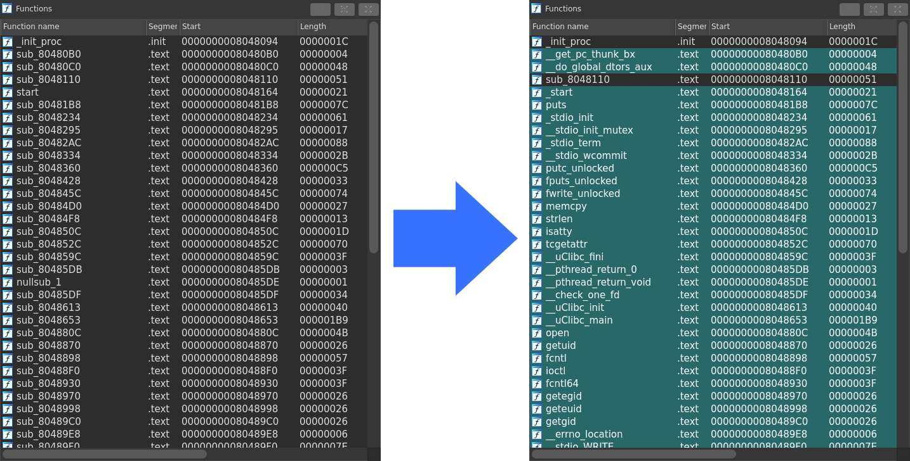

# stelftools: cross-architecture static library detector for IoT malware

## Description

`stelftools` is a signature matching tool for identifying statically-linked library functions for IoT malware. Detecting library functions in IoT malware is essential because most IoT malware is likely to contain a certain amount of code of library functions, which we do not need to read for analysis. `stelftools` reduces the effort of analysts to read such a part of code by correctly identifying and annotating them with their symbol name. 
The figure below shows that `stelftools`(IDA plugin mode) recognizes many functions and turns their names, which are started with "sub_", into their symbol name, highlighted by green. 

<div align="center">

</div>

`stelftools` comprises a matching tool and a set of YARA signatures supporting the following 17 architectures and over 700 toolchains. We can cover almost all types of toolchains we can see in current IoT malware with these signatures. Specifically, we could identify the all toolchain of 3,991 IoT malware that we had collected using our IoT honeypots. Additionally, we provide a tool for generating a YARA signature from a given toolchain just in the case when malware is built with a toolchain that is not covered by these signatures. 

- Supported Architecture
  - ARC
  - ARM / AArch64
  - MIPS / MIPSEL / MIPS64 / MIPS64EL
  - Motorola 68000
  - PowerPC / PowerPC64
  - RISC-V 32 / RISC-V 64
  - SuperH
  - SPARC / SPARC64
  - Intel 80386 / x86_64

Moreover, we developed several heuristics based on our observation of compiler and linker behaviors into `stelftools` to reduce false detection. We then achieved the highest detection accuracy, i.e., 97.18%, compared to publicly available tools for statically-linked library function detection, such as IDA FLIRT [1], BinDiff [2], or rizzo [3].

We can use `stelftools` as a command-line tool or a plugin for a reverse engineering tool of IDA and Ghidra. We believe it would be a best friend for practitioners to keep close with and use in their daily IoT malware analysis.

## Features
`stelftools` is composed of the following three parts: pattern matcher, YARA signatures, and generator. 

- Pattern Match (`func_ident.py`, `ida_stelftools.py`, `ghidra_stelftools.py`)
  - It receives an ELF binary as an input, and then it outputs a list of detected functions' address and name. 
  - It has several heuristics to recude false detection. 
    - Exclude detection on the basis of short rules
    - Exclude detection occured ouside of user-defined areas.
    - Prioritize based on library function dependencies and link order. 
  - You can also invoke this script from a reverse engineering tools, such as IDA or Ghidra, as well as using as a command-line tool. 

- YARA Signatures (`yara-patterns`)
  - We generated YARA signatures for 17 architectures and over 700 toolchains in advanced and published them in the `stelftools` repository. 
  - We can cover almost all toolchain used in current IoT malware dataset with these signatures. 

- Pattern Generation (`libfunc_info_create.py`)
  - It receives a toolchain path as an input, i.e., a path to a directory containing .a and .o files (static library files), and then it outpus YARA rules for detecting the library functions of the static library files. 
  - It generates a set of flexible rules supporting relocation, optimization and linker relaxation to achieve a high detection accuracy. 


## Comparison with other function identification tools

We have compared `stelftools` with other tools for statically-linked library function detection, IDA FLIRT [1], BinDiff [2], and rizzo [3], using the dataset composed of `150` malware samples. 
The below table shows the results of the comparison. As you can see, `stelftools` achieves the highest detection accuracy indicating that it correctly detected 97.18% of the statically-linked functions used in the dataset.

| `stelftools` | IDA FLIRT | BinDiff | rizzo  |
| ------------ | ----------| --------| -------|
| 97.18%       | 91.79%    | 82.82%  | 81.56% |

## Requirement
### python3 package
|  Package    | Version |
|:------------|:--------|
| [arpy](https://pypi.org/project/arpy/)                 | 2.2.0  |
| [yara-python](https://pypi.org/project/yara-python/)   | 4.2.0  |
| [capstone](https://pypi.org/project/capstone/)         | 4.0.2  |
| [pyelftools](https://pypi.org/project/pyelftools/)     | 0.28   |
| [python-magic](https://pypi.org/project/python-magic/) | 0.4.25 |
| [cxxfilt](https://pypi.org/project/cxxfilt/)           | 0.3.0  |

## Usage 
### How to Install

#### init setup

To install necessary python3 packages and configure the paths used in tools.  

```bash
./setup/init.sh
```

#### IDA Pro plugin setup (Needed when you use in IDA plugin mode)

To make a symblic link in the IDA's plugin directory to stelftools.

```bash
./setup/ida_setup.sh {path to IDA Pro install directory}
```

### How to Use

#### Command line mode  

##### Library Function Identification

```bash
python3 ./func_ident.py -cfg ./toolchain_config/{name of toolchain}.json -target {path to target binary}
```
- -cfg: the config file for a toolchain 
  - *Recommendation*
    - When you do not know which toolchain you should specify for your analysis, we recommend to try to specify the toolchain in the following order because our previous study [4] shows the trend of toolchain used in IoT malware.  
      - firmware linux 0.9.6, i.e. `fl-0.9.6_{arch}`
      - firmware linux, i.e. `fl-{0.9.7 ~ 0.9.11}_{arch}`
      - aboriginal linux, i.e., `al-{1.0.0 ~ 1.4.5}_{arch}`
      - bootlin, i.e., `bl-{version}_{libc}_{arch}`
      - buildroot, i.e.,`br-{version}_{libc}_{arch}`
      - other
- -target: the binary path to be analyzed

Example
```bash
$ python3 ./func_ident.py -cfg ./toolchain_config/ucli-pub-0.9.30.1_i586.json -target ./sample/main.i586
0x8048094 _fini,_init
0x80480b0 __get_pc_thunk_bx
0x80480c0 __do_global_dtors_aux
0x8048164 _start
0x80481b8 puts
0x8048234 _stdio_init
0x8048295 __stdio_init_mutex
0x80482ac _stdio_term
0x8048334 __stdio_wcommit
0x8048360 putc_unlocked
0x8048428 fputs_unlocked
0x804845c fwrite_unlocked
0x80484d0 memcpy
0x80484f8 strlen
0x804850c isatty
0x804852c tcgetattr
0x804859c __uClibc_fini
0x80485db __pthread_return_0
0x80485de __pthread_return_void
0x80485df __check_one_fd
0x8048613 __uClibc_init
0x8048653 __uClibc_main
0x804880c open
0x8048857 creat
0x8048870 getuid
0x8048898 fcntl
0x80488f0 ioctl
0x8048930 fcntl64
0x8048970 getegid
0x8048998 geteuid
0x80489c0 getgid
0x80489e8 __errno_location
0x80489f0 __stdio_WRITE
0x8048a70 __stdio_fwrite
0x8048b60 __stdio_trans2w_o
0x8048c00 memchr
0x8048c24 memset
0x8048c3c memrchr
0x8048cec mempcpy
0x8048d10 abort
0x8048e24 exit
0x8048e8c _dl_aux_init
0x8048eaf sigaction
0x8048f88 __syscall_rt_sigaction
0x8048fc4 write
0x8048ffc sigprocmask
0x8049054 _exit
0x804907c fseek
0x8049098 fseeko64
0x804917c __stdio_adjust_position
0x8049224 __stdio_seek
0x8049258 raise
0x8049270 __sigismember
0x8049294 __sigaddset
0x80492b4 __sigdelset
0x80492d4 getpid
0x80492fc kill
0x8049330 lseek64
0x8049390 __do_global_ctors_aux
0x80493b8 _fini,_init
```

##### YARA Rules Generation

First of all, you have to prepare a compiled toolchain and then run the following commands. 

```bash
python3 ./libfunc_info_create.py -name {toolchain name} -cp {toolchain compiler path} -arch {toolchain archtecture} 
  or 
python3 ./libfunc_info_create.py -name {toolchain name} -tp {toolchain directory path} -cp {toolchain compiler path} -arch {toolchain archtecture} 
```
- -name: the name of toolchain
- -tp: the path of the toolchain directory (additional)
- -cp: the path of the compiler of a toolchain
- -arch: the architecture of a toolchain


##### Toolchain identification

Even if the toolchain used in the sample build is unknown, it may be possible to identify the toolchain using brute-force. 

```bash
python3 _bruteforce-ident.py -target {path to target binary} 
  or 
python3 _bruteforce-ident.py -arch AUTO -target {path to target binary} 
```


#### IDA plugin mode  

##### Library Function Identification  
1. **File** → **Load file** → **Stelftools toolchain config file...**  
2. open toolchain config file 


##### YARA Rules Generation  
1. **File** → **Produce file** → **Stelftools toolchain config file...**   
2. input toolchain name  
3. choose toolchain compiler path  
4. input toolchain architecture  


#### Ghidra plugin mode  

##### Library Function Identification  
0. **Script Manager** → Scripts/stelftools/python/**ghidra_stelftools.py** → select **func_ident**  
1. select toolchain json file (toolchain_name.json)  


##### YARA Rules Generation  
0. **Script Manager** → Scripts/stelftools/python/**ghidra_stelftools.py** → select **make_rules**  
1. type toolchain name  
2. select toolchain directory
3. select a compiler for the toolchain (additional option)
4. type architecture


## License 
MIT License

## References
- [1] IDA https://hex-rays.com/products/ida/tech/flirt/ 
- [2] BinDiff https://www.zynamics.com/bindiff.html 
- [3] rizzo https://github.com/tacnetsol/ida 
- [4] "Identification of toolchains used to build IoT malware with statically linked libraries" https://doi.org/10.1016/j.procs.2021.09.291 
