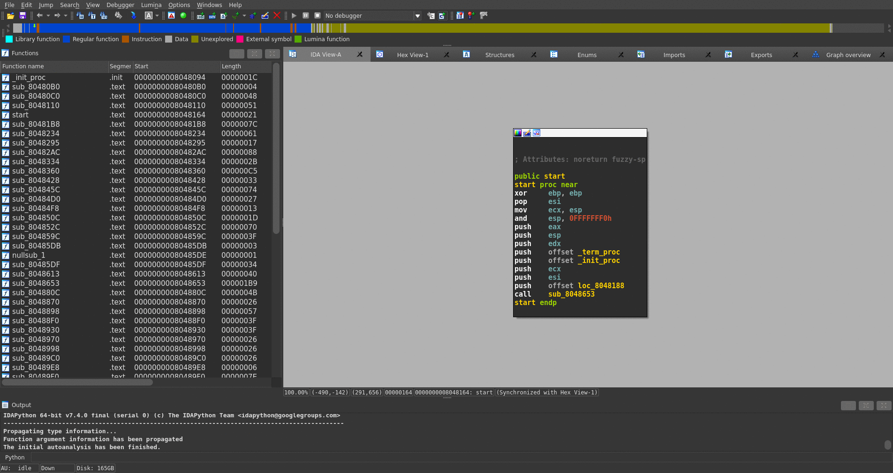
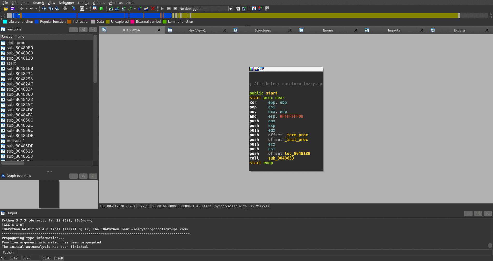
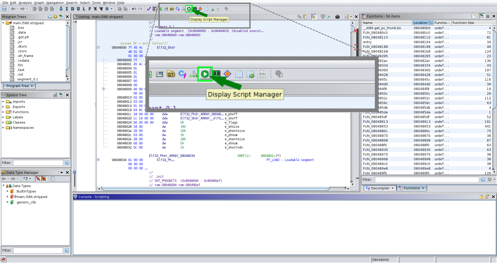

# How to Install
stelftools is usable on the command line or as a plugin for IDA Pro or Ghidra.  
### init setup
Install the python3 package used by stelftools and update the paths in scripts.  
```bash
./setup/init.sh
```
## IDA Pro plugin setup
Create a symbolic link to stelftools in the IDA plugin directory.  
```bash
./setup/ida_setup.sh {path to IDA Pro install directory}
```
## Ghidra plugin setup  
Create a symbolic link to stelftools in the ghidra script directory.  
```bash
./setup/ghidra_setup.sh {path to ghidra install directory}
```

# How to Use
stelftools can be executed in three ways.  
## Command line mode
#### Generate YARA rules and other rules used for matching
```bash
python3 ./libfunc_info_create.py -name {toolchain name} -cp {toolchain compiler path} -arch {toolchain archtecture} 
  or 
python3 ./libfunc_info_create.py -name {toolchain name} -tp {toolchain directory path} -cp {toolchain compiler path} -arch {toolchain archtecture} 
```
- -name: the name of toolchain
- -tp: the path of the toolchain directory (additional)
- -cp: the path of the compiler of a toolchain
- -arch: the architecture of a toolchain
#### Identification of library functions
```bash
python3 ./func_ident.py -cfg ./toolchain_config/{name of toolchain}.json -target /path/to/target
```
- -cfg: the config file for a toolchain 
  - *Recommendation*
    - When you do not know which toolchain you should specify for your analysis, we recommend to try to specify the toolchain in the following order because our previous study [4] shows the trend of toolchain used in IoT malware.  
      - firmware linux 0.9.6, i.e. `fl-0.9.6_{arch}`
      - firmware linux, i.e. `fl-{0.9.7 ~ 0.9.11}_{arch}`
      - aboriginal linux, i.e., `al-{1.0.0 ~ 1.4.5}_{arch}`
      - bootlin, i.e., `bootlin_{arch}--{libc}--{version}`
      - other
- -target: the binary path to be analyzed

## IDA plugin mode
##### Library Function Identification
1. **File** → **Load file** → **Stelftools toolchain config file...**  
2. open toolchain config file  


##### YARA Rules Generation
1. **File** → **Produce file** → **Stelftools toolchain config file...**   
2. input toolchain name  
3. choose toolchain compiler path  
4. input toolchain architecture  



## Ghidra plugin mode
##### Library Function Identification  
0. **Script Manager** → Scripts/stelftools/python/**ghidra_stelftools.py** → select **func_ident**  
1. select toolchain json file (toolchain_name.json)  


##### YARA Rules Generation  
0. **Script Manager** → Scripts/stelftools/python/**ghidra_stelftools.py** → select **make_rules**  
1. type toolchain name  
2. select toolchain directory
3. select a compiler for the toolchain (additional option)
4. type architecture

